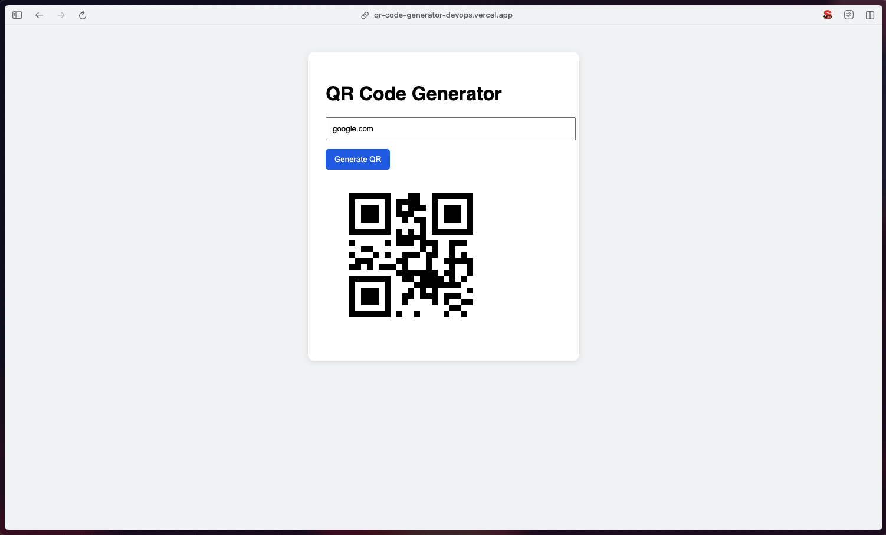

# QR Code Generator App 🧾

A simple fullstack project that allows users to generate QR codes from URLs. Built as a DevOps & Cloud portfolio project, with Docker, Terraform, and modern deployment workflows.

## Tech Stack
- Python + Flask (backend)
- HTML + CSS (frontend)
- Docker & Docker Compose
- GitHub Actions (CI/CD)
- Vercel & Render (deployment)

## 🚀 Local Development (with Docker Compose)
To run the project locally using Docker Compose:

git clone https://github.com/florencito/qr-code-generator-devc.git

cd qr-code-generator-devc

docker-compose up --build

This will start:

Backend (Flask API) on http://localhost:8000

Frontend (HTML + JS) on http://localhost:3000

Then, go to http://localhost:3000, enter a URL and click Generate QR to get your code.

## 🐳 Docker-only
If you want to run the backend alone using Docker:

cd backend

docker build -t qr-backend .

docker run -p 8000:8000 qr-backend

Then use Postman or curl to test the /generate endpoint.

## 🗂️ Project Structure
qr-code-generator/

├── backend/  # Flask API to generate QR

├── frontend/  # Static HTML + JS frontend

├── docker-compose.yml  # Compose file to run both services

├── terraform/  # (WIP) Simulated AWS infra

├── render.yaml  # Configuration for Render deployment

└── README.md

---

### 🌍 Live Demo
Note: First load may take a few seconds as the backend is hosted on a free Render instance that sleeps when inactive.

- 🔗 Frontend: [https://qr-code-generator-devops.vercel.app/](https://qr-code-generator-devops.vercel.app/)
- 🔗 Backend: [https://qr-backend-83wg.onrender.com/generate](https://qr-backend-83wg.onrender.com/generate)

---

### ☁️ Deployment Details

#### ✅ Backend (Flask on Render)
- Hosted for free on [Render.com](https://render.com)
- Deploy method: GitHub → Python environment (no Docker)
- Live endpoint: `/generate`

#### ✅ Frontend (Static site on Vercel)
- Hosted on [Vercel](https://vercel.com)
- Static HTML + JS
- Fetches data from backend via `fetch()`

---

### 🧠 What I Learned

- Creating and containerizing a Flask API
- Handling CORS and frontend-backend communication
- Deploying services with Render and Vercel
- Docker Compose orchestration
- Writing clean and maintainable infrastructure

---

### 📸 Screenshots

---

### 👨‍💻 Author

**Florencio Reyes** – DevOps & Cloud Enthusiast  
[LinkedIn](https://www.linkedin.com/in/florencio-reyes/) | [GitHub](https://github.com/florencito)

---
